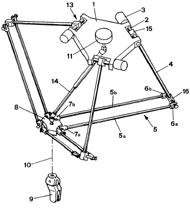
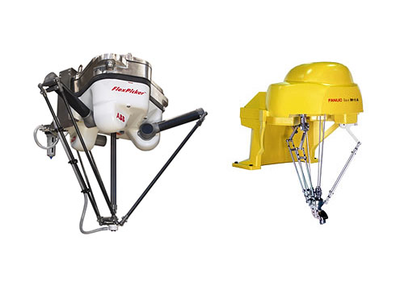
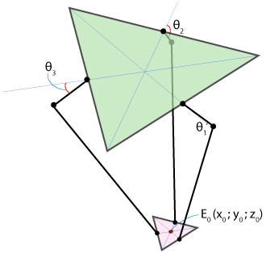
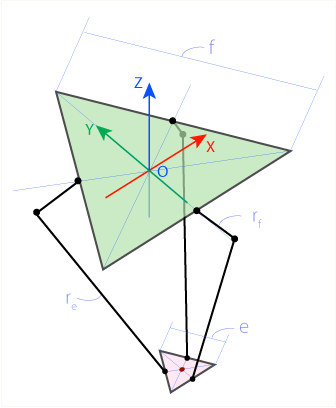
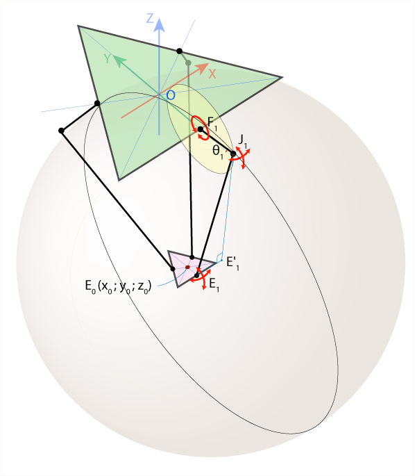
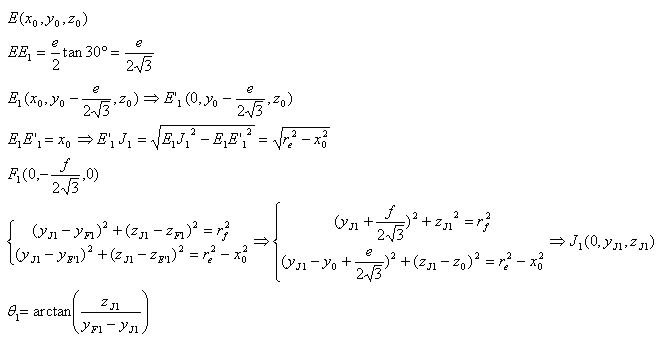
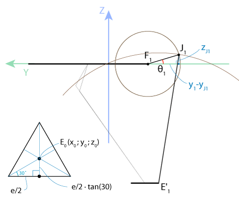
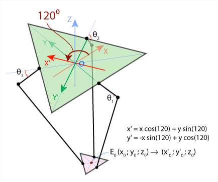
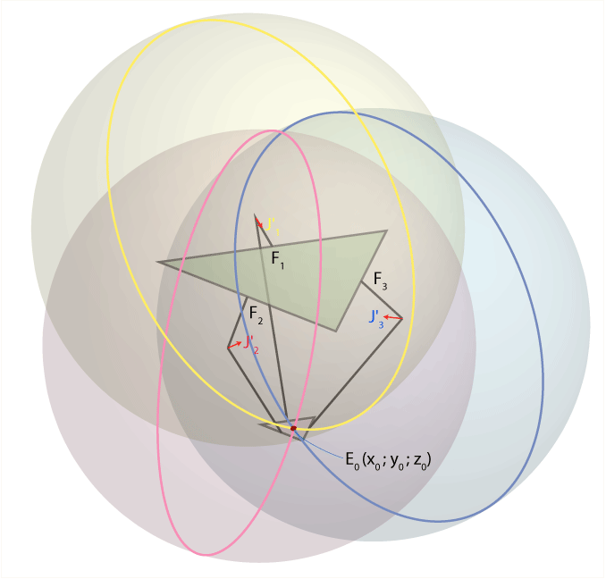
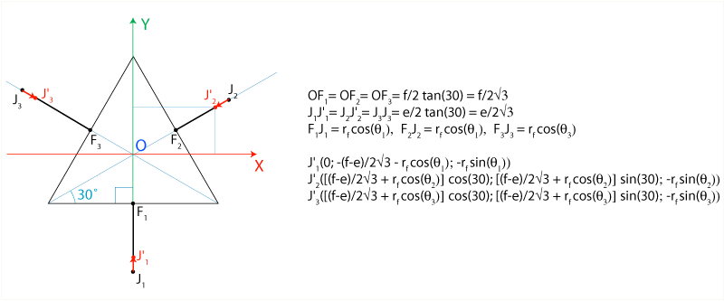

I've taken the liberty to github-flavoured-markdownify and upload this
forum post.

> Source: [forums.trossenrobotics.com](http://forums.trossenrobotics.com/tutorials/introduction-129/delta-robot-kinematics-3276/?s=9634c5b9738093a1033b3731708ab58c&page=5)
> Author: [mzavatsky](http://forums.trossenrobotics.com/member.php?3300-mzavatsky)

# Delta robot kinematics

Difficulty: Medium

## Delta robot kinematics

When one talks about industrial robots, most of people imagine robotic arms, or articulated robots, which are doing painting, welding, moving something, etc. But there is another type of robots: so-called parrallel delta robot, which was invented in the early 80's in Switzerland by professor Reymond Clavel. Below the original technical drawing from U.S. Patent 4,976,582 is shown.



And two real industrial delta robots, one from ABB, and one from Fanuc.



The delta robot consists of two platforms: the upper one (1) with three motors (3) mounted on it, and smaller one (8) with an end effector (9). The platforms are connected through three arms with parallelograms, the parallelograms restrain the orientation of the lower platform to be parallel to the working surface (table, conveyor belt and so on). The motors (3) set the position of the arms (4) and, thereby, the XYZ-position of the end effector, while the fourth motor (11) is used for rotation of the end effector. You can find more detailed description of delta robot design in the corresponding [Wikipedia article](http://en.wikipedia.org/wiki/Delta_robot).

The core advantage of delta robots is speed. When typical robot arm has to move not only payload, but also all servos in each joint, the only moving part of delta robot is its frame, which is usually made of lightweight composite materials. To get an evidence of delta robots outstanding abilities, take a look at [this](http://www.youtube.com/watch?v=foTE0Mau5a8) and [this](http://www.youtube.com/watch?v=v9oeOYMRvuQ) video. Due to its speed, delta robots are widely used in pick-n-place operations of relatively light objects (up to 1 kg).

## Problem definition

If we want to build our own delta robot, we need to solve two problems. First, if we know the desired position of the end effector (for example, we want to catch pancake in the point with coordinates X,Y,Z), we need to determine the corresponding angles of each of three arms (joint angles) to set motors (and, thereby, the end effector) in proper position for picking. The process of such determining is known as **inverse kinematics**.
And, in the second place, if we know joint angles (for example, we've read the values of motor encoders), we need to determine the position of the end effector (e.g. to make some corrections of its current position). This is **forward kinematics** problem.

To be more formal, let's look at the kinematic scheme of delta robot. The platforms are two equilateral triangles: the fixed one with motors is green, and the moving one with the end effector is pink. Joint angles are theta1, theta2 and theta3, and point E0 is the end effector position with coordinates (x0, y0, z0). To solve inverse kinematics problem we have to create function with E0 coordinates (x0, y0, z0) as parameters which returns (theta1, theta2, theta3). Forward kinematics functions gets (theta1, theta2, theta3) and returns (x0, y0, z0).



In the following two paragraphs will come the theoretical part of delta robots kinematics. Those who don't like mathematics and trigonometry may jump right to the practical part: sample programs written in C language. So, let's start from

## Inverse Kinematics

First, let's determine some key parameters of our robot's geometry. Let's designate the side of the fixed triangle as f, the side of the end effector triangle as e, the length of the upper joint as rf, and the length of the parallelogram joint as re. These are physical parameters which are determined by design of your robot. The reference frame will be choosen with the origin at the center of symmetry of the fixed triangle, as shown below, so z-coordinate of the end effector will always be negative.



Because of robot's design joint F1J1 (see fig. below) can only rotate in YZ plane, forming circle with center in point F1 and radius rf. As opposed to F1, J1 and E1 are so-called [universal joints](http://en.wikipedia.org/wiki/Universal_joints), which means that E1J1 can rotate freely relatively to E1, forming sphere with center in point E1 and radius re.



Intersection of this sphere and YZ plane is a circle with center in point E'1 and radius E'1J1, where E'1 is the projection of the point E1 on YZ plane. The point J1 can be found now as intersection of to circles of known radius with centers in E'1 and F1 (we should choose only one intersection point with smaller Y-coordinate). And if we know J1, we can calculate theta1 angle.

Below you can find corresponding equations:



And the YZ plane view:




Such algebraic simplicity follows from good choice of reference frame: joint F1J1 moving in YZ plane only, so we cat completely omit X coordinate. To take this advantage for the remaining angles theta2 and theta3, we should use the symmetry of delta robot. First, let's rotate coordinate system in XY plane around Z-axis through angle of 120 degrees counterclockwise, as it is shown below.



We've got a new reference frame X'Y'Z', and it this frame we can find angle theta2 using the same algorithm that we used to find theta1. The only change is that we need to determine new coordinates x'0 and y'0 for the point E0, which can be easily done using corresponding [rotation matrix](http://en.wikipedia.org/wiki/Rotation_matrix). To find angle theta3 we have to rotate reference frame clockwise. This idea is used in the coded example below: I have one function which calculates angle theta for YZ plane only, and call this function three times for each angle and each reference frame.

## Forward kinematics

Now the three joint angles theta1, theta2 and theta3 are given, and we need to find the coordinates (x0, y0, z0) of end effector point E0.
As we know angles theta, we can easily find coordinates of points J1, J2 and J3 (see fig. below). Joints J1E1, J2E2 and J3E3 can freely rotate around points J1, J2 and J3 respectively, forming three spheres with radius re.


Now let's do the following: move the centers of the spheres from points J1, J2 and J3 to the points J'1, J'2 and J'3 using transition vectors E1E0, E2E0 and E3E0 respectively. After this transition all three spheres will intersect in one point: E0, as it is shown in fig. below:


So, to find coordinates (x0, y0, z0) of point E0, we need to solve set of three equations like (x-xj)^2+(y-yj)^2+(z-zj)^2 = re^2, where coordinates of sphere centers (xj, yj, zj) and radius re are known.

First, let's find coordinates of points J'1, J'2, J'3:



In the following equations I'll designate coordinates of points J1, J2, J3 as (x1, y1, z1), (x2, y2, z2) and (x3, y3, z3). Please note that x0=0. Here are equations of three spheres:



Finally, we need to solve this quadric equation and find z0 (we should choose the smallest negative equation root), and then calculate x0 and y0 from eq. (7) and (8).

## Sample programs

The following code is written in C, all variable names correspond to designations I've used above. Angles theta1, theta2 and theta3 are in degrees. You can freely use this code in your applications.

Code:

```c
 // robot geometry
 // (look at pics above for explanation)
 const float e = 115.0;     // end effector
 const float f = 457.3;     // base
 const float re = 232.0;
 const float rf = 112.0;

 // trigonometric constants
 const float sqrt3 = sqrt(3.0);
 const float pi = 3.141592653;    // PI
 const float sin120 = sqrt3/2.0;   
 const float cos120 = -0.5;        
 const float tan60 = sqrt3;
 const float sin30 = 0.5;
 const float tan30 = 1/sqrt3;

 // forward kinematics: (theta1, theta2, theta3) -> (x0, y0, z0)
 // returned status: 0=OK, -1=non-existing position
 int delta_calcForward(float theta1, float theta2, float theta3, float &x0, float &y0, float &z0) {
     float t = (f-e)*tan30/2;
     float dtr = pi/(float)180.0;

     theta1 *= dtr;
     theta2 *= dtr;
     theta3 *= dtr;

     float y1 = -(t + rf*cos(theta1));
     float z1 = -rf*sin(theta1);

     float y2 = (t + rf*cos(theta2))*sin30;
     float x2 = y2*tan60;
     float z2 = -rf*sin(theta2);

     float y3 = (t + rf*cos(theta3))*sin30;
     float x3 = -y3*tan60;
     float z3 = -rf*sin(theta3);

     float dnm = (y2-y1)*x3-(y3-y1)*x2;

     float w1 = y1*y1 + z1*z1;
     float w2 = x2*x2 + y2*y2 + z2*z2;
     float w3 = x3*x3 + y3*y3 + z3*z3;

     // x = (a1*z + b1)/dnm
     float a1 = (z2-z1)*(y3-y1)-(z3-z1)*(y2-y1);
     float b1 = -((w2-w1)*(y3-y1)-(w3-w1)*(y2-y1))/2.0;

     // y = (a2*z + b2)/dnm;
     float a2 = -(z2-z1)*x3+(z3-z1)*x2;
     float b2 = ((w2-w1)*x3 - (w3-w1)*x2)/2.0;

     // a*z^2 + b*z + c = 0
     float a = a1*a1 + a2*a2 + dnm*dnm;
     float b = 2*(a1*b1 + a2*(b2-y1*dnm) - z1*dnm*dnm);
     float c = (b2-y1*dnm)*(b2-y1*dnm) + b1*b1 + dnm*dnm*(z1*z1 - re*re);

     // discriminant
     float d = b*b - (float)4.0*a*c;
     if (d < 0) return -1; // non-existing point

     z0 = -(float)0.5*(b+sqrt(d))/a;
     x0 = (a1*z0 + b1)/dnm;
     y0 = (a2*z0 + b2)/dnm;
     return 0;
 }

 // inverse kinematics
 // helper functions, calculates angle theta1 (for YZ-pane)
 int delta_calcAngleYZ(float x0, float y0, float z0, float &theta) {
     float y1 = -0.5 * 0.57735 * f; // f/2 * tg 30
     y0 -= 0.5 * 0.57735    * e;    // shift center to edge
     // z = a + b*y
     float a = (x0*x0 + y0*y0 + z0*z0 +rf*rf - re*re - y1*y1)/(2*z0);
     float b = (y1-y0)/z0;
     // discriminant
     float d = -(a+b*y1)*(a+b*y1)+rf*(b*b*rf+rf);
     if (d < 0) return -1; // non-existing point
     float yj = (y1 - a*b - sqrt(d))/(b*b + 1); // choosing outer point
     float zj = a + b*yj;
     theta = 180.0*atan(-zj/(y1 - yj))/pi + ((yj>y1)?180.0:0.0);
     return 0;
 }

 // inverse kinematics: (x0, y0, z0) -> (theta1, theta2, theta3)
 // returned status: 0=OK, -1=non-existing position
 int delta_calcInverse(float x0, float y0, float z0, float &theta1, float &theta2, float &theta3) {
     theta1 = theta2 = theta3 = 0;
     int status = delta_calcAngleYZ(x0, y0, z0, theta1);
     if (status == 0) status = delta_calcAngleYZ(x0*cos120 + y0*sin120, y0*cos120-x0*sin120, z0, theta2);  // rotate coords to +120 deg
     if (status == 0) status = delta_calcAngleYZ(x0*cos120 - y0*sin120, y0*cos120+x0*sin120, z0, theta3);  // rotate coords to -120 deg
     return status;
 }
```

## Acknowledgements

All core ideas about delta robot kinematics are taken from the article of Prof. Paul Zsombor-Murray Descriptive Geometric Kinematic Analysis of Clavel's "Delta" Robot. It's a great publication, but it requires a very strong mathematical background for understanding.

## Sample build

I've used the programs listed above in my model of delta robot made of standard Lego parts. It uses Lego Mindstorms NXT as "brain", and a program written in RobotC. Below the robot is shown in action, so you can be sure that this programs realy work

[](https://www.youtube.com/watch?v=V_FoJWm2lOI "Robot")

Now you know enough about delta robot kinematics to build your own. Enjoy!
